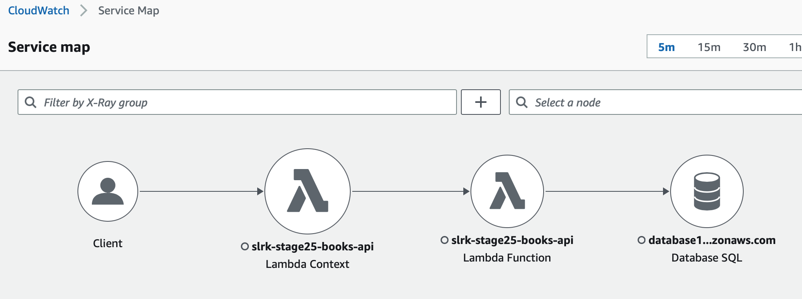
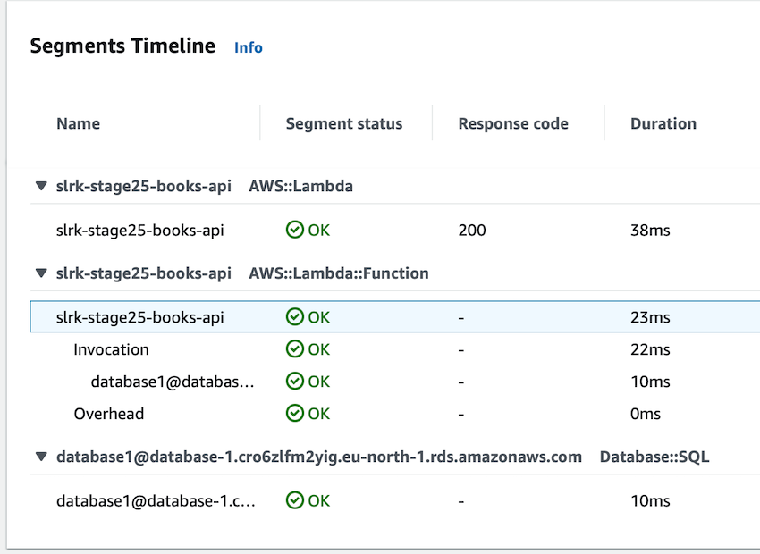

# Get better insights with AWS X-Ray
Tags: aws tracing logging lambda x-ray slf4j mdc microservices spring micronaut


AWS X-Ray is a distributed tracing framework that provides a view over how your request travels through the application and infrastructure.
You can enable it for AWS Lambda but for other workloads you also need to install an agent. Your application also needs to integrate with the AWS X-Ray SDK.

With AWS X-Ray you can see for instance the response time and latencies in the request flow and identify bottlenecks.

The tracing is based on sampling so X-Ray is not suited for audit purposes and long time storage isn't supported either.

## Small demo with an AWS Lambda behind an API Gateway and a database

The setup in the small demo is a lambda function that implements a REST API with basic CRUD operations.
The DB is AWS RDS MySQL but it can be any DB. The lambda is deployed behind the API Gateway.

The lambda function needs to be deployed with "advanced tracing" enabled.
AWS will then add HTTP headers with a unique X-Ray ID, like a request ID and downstream the X-Ray SDK make sure it is passed along in any calls to other AWS services your application is using.

If the lambda is written in Java and your are using some of the lambda to HTTP proxies for SpringBoot or Micronaut then you can log the X-Ray ID in the application log also since AWS adds it to the MDC (Message Diagnostic Context) for SLF4J:

```XML
  <appender name="STDOUT" class="ch.qos.logback.core.ConsoleAppender">
    <encoder class="ch.qos.logback.classic.encoder.PatternLayoutEncoder">
      <pattern>[%date{yyyy-MM-dd'T'HH:mm:ss.SSSX, UTC}] [${HOSTNAME}] [%thread] %-5level %logger{36} - AWS-XRAY-TRACE-ID=%mdc{AWS-XRAY-TRACE-ID:-N/A} - AWSRequestId=%mdc{AWSRequestId:-N/A} - %msg%n
      </pattern>
    </encoder>
  </appender>
```

In order to trace the calls to the DB you need to wrap your data source with a tracing capable data source.
First depend on:

```
implementation 'com.amazonaws:aws-xray-recorder-sdk-sql:2.13.0'
```

Then you need to create the datasource instance and wrap it. Below is how it is done in Micronaut and Hikari connection pool:

```
import javax.sql.DataSource;
import com.amazonaws.xray.sql.TracingDataSource;
import io.micronaut.configuration.jdbc.hikari.DatasourceConfiguration;
import io.micronaut.configuration.jdbc.hikari.DatasourceFactory;
import io.micronaut.context.ApplicationContext;
import io.micronaut.context.annotation.*;

@Factory
@Replaces(factory = DatasourceFactory.class)
public class XrayDataSourceFactory extends DatasourceFactory {
  public XrayDataSourceFactory(ApplicationContext applicationContext) {
    super(applicationContext);
  }
  @Override
  @Context
  @EachBean(DatasourceConfiguration.class)
  public DataSource dataSource(DatasourceConfiguration datasourceConfiguration) {
    return new TracingDataSource(super.dataSource(datasourceConfiguration));
  }
}
```

## Analyze X-Ray in CloudWatch logs UI
To examine the request flow for the lambda navigate to CloudWatch and select X-Ray traces from the left menu.
You will get an overview over the activities using the "Service map" tab. Remember to pick a time frame.



You can then drill down per request or view the average.



